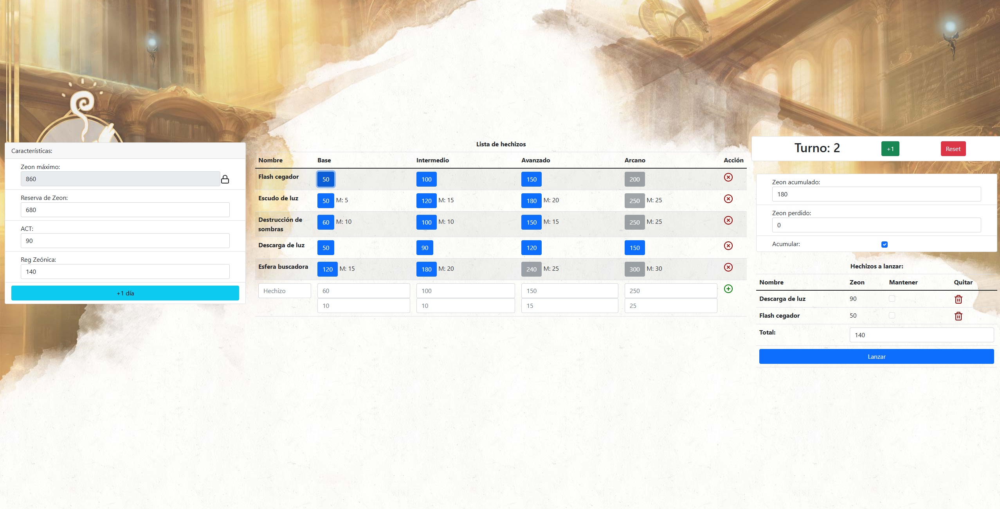

<div id="top">

<!-- HEADER STYLE: CLASSIC -->
<div align="center">


<em>Anima Beyond Fantasy Zeon Counter</em>

<!-- BADGES -->
<!-- local repository, no metadata badges. -->

<em>Built with the tools and technologies:</em>


</div>
<br>

---

## Table of Contents

- [Table of Contents](#table-of-contents)
- [Overview](#overview)
- [Project Structure](#project-structure)
  - [Project Index](#project-index)
- [Getting Started](#getting-started)
  - [Prerequisites](#prerequisites)
  - [Installation](#installation)
  - [Overview](#overview-1)
- [Contributing](#contributing)
- [License](#license)
- [Acknowledgments](#acknowledgments)

---

## Overview

This is a web based tool for help players of Anima Beyond Fantasy role playing game. It provides a complex zeon counter with the ability of adding and managing your own spell's list.

---

## Project Structure

```sh
└── /
    ├── README.md
    ├── _config.yml
    ├── images
    │   └── background.jpeg
    ├── index.html
    ├── index.js
    └── style.css
```

### Project Index

<details open>
    <summary><b><code>/</code></b></summary>
    <!-- __root__ Submodule -->
    <details>
        <summary><b>__root__</b></summary>
        <blockquote>
            <div class='directory-path' style='padding: 8px 0; color: #666;'>
                <code><b>⦿ __root__</b></code>
            <table style='width: 100%; border-collapse: collapse;'>
            <thead>
                <tr style='background-color: #f8f9fa;'>
                    <th style='width: 30%; text-align: left; padding: 8px;'>File Name</th>
                    <th style='text-align: left; padding: 8px;'>Summary</th>
                </tr>
            </thead>
                <tr style='border-bottom: 1px solid #eee;'>
                    <td style='padding: 8px;'><b><a href='/index.js'>index.js</a></b></td>
                    <td style='padding: 8px;'>- Index.js serves as the applications entry point, initiating the main program flow<br>- It orchestrates the loading and interaction of core modules, establishing connections to external services and databases if necessary<br>- The files execution triggers the application's functionality, making it the central component for launching and managing the entire system.</td>
                </tr>
                <tr style='border-bottom: 1px solid #eee;'>
                    <td style='padding: 8px;'><b><a href='/_config.yml'>_config.yml</a></b></td>
                    <td style='padding: 8px;'>- Config.yml specifies the Jekyll theme Merlot for the project<br>- It acts as a central configuration file, defining the visual presentation of the website<br>- Within the broader project architecture, this file dictates the overall aesthetic and user interface, leveraging the themes pre-built features and styling<br>- The theme selection impacts the sites appearance and user experience.</td>
                </tr>
                <tr style='border-bottom: 1px solid #eee;'>
                    <td style='padding: 8px;'><b><a href='/style.css'>style.css</a></b></td>
                    <td style='padding: 8px;'>- The <code>style.css</code> file defines the visual presentation of the web application<br>- It sets background images, container padding, element margins, and button styles<br>- Responsive design is implemented using media queries to adjust layout for different screen sizes<br>- The styles also address specific elements, such as input fields and icons, ensuring consistent visual appeal and user experience across the application.</td>
                </tr>
                <tr style='border-bottom: 1px solid #eee;'>
                    <td style='padding: 8px;'><b><a href='/index.html'>index.html</a></b></td>
                    <td style='padding: 8px;'>- The <code>index.html</code> file serves as the main entry point for the Zeon Counter web application<br>- It uses Bootstrap and Feather Icons for styling and incorporates Vue.js to create an interactive user interface for tracking and managing various numerical values (presumably related to a game or application called Zeon)<br>- The file's purpose is to present this interactive counter to the user within a web browser.</td>
                </tr>
            </table>
        </blockquote>
    </details>
</details>

---

## Getting Started

### Prerequisites

This project requires the following dependencies:

- **Programming Language:** JavaScript
- **Framework used**: Vue.js embedded 

### Installation

Build  from the source and install dependencies:

1. **Clone the repository:**

    ```sh
    ❯ git clone ../
    ```

2. **Navigate to the project directory:**

    ```sh
    ❯ cd 
    ```

3. **Execute index.html file**

Open with web browser index.html file

### Overview



---

## Contributing

- **💬 [Join the Discussions](https://LOCAL///discussions)**: Share your insights, provide feedback, or ask questions.
- **🐛 [Report Issues](https://LOCAL///issues)**: Submit bugs found or log feature requests for the `` project.
- **💡 [Submit Pull Requests](https://LOCAL///blob/main/CONTRIBUTING.md)**: Review open PRs, and submit your own PRs.

<details closed>
<summary>Contributing Guidelines</summary>

1. **Fork the Repository**: Start by forking the project repository to your LOCAL account.
2. **Clone Locally**: Clone the forked repository to your local machine using a git client.
   ```sh
   git clone ./
   ```
3. **Create a New Branch**: Always work on a new branch, giving it a descriptive name.
   ```sh
   git checkout -b new-feature-x
   ```
4. **Make Your Changes**: Develop and test your changes locally.
5. **Commit Your Changes**: Commit with a clear message describing your updates.
   ```sh
   git commit -m 'Implemented new feature x.'
   ```
6. **Push to LOCAL**: Push the changes to your forked repository.
   ```sh
   git push origin new-feature-x
   ```
7. **Submit a Pull Request**: Create a PR against the original project repository. Clearly describe the changes and their motivations.
8. **Review**: Once your PR is reviewed and approved, it will be merged into the main branch. Congratulations on your contribution!
</details>

---

## License

This project is protected under the [MIT LICENSE](https://opensource.org/license/mit) License. For more details, refer to the [LICENSE](./LICENSE.txt) file.

---

## Acknowledgments

- Credit `contributors`, `inspiration`, `references`, etc.

<div align="right">

[![][back-to-top]](#top)

</div>


[back-to-top]: https://img.shields.io/badge/-BACK_TO_TOP-151515?style=flat-square


---
